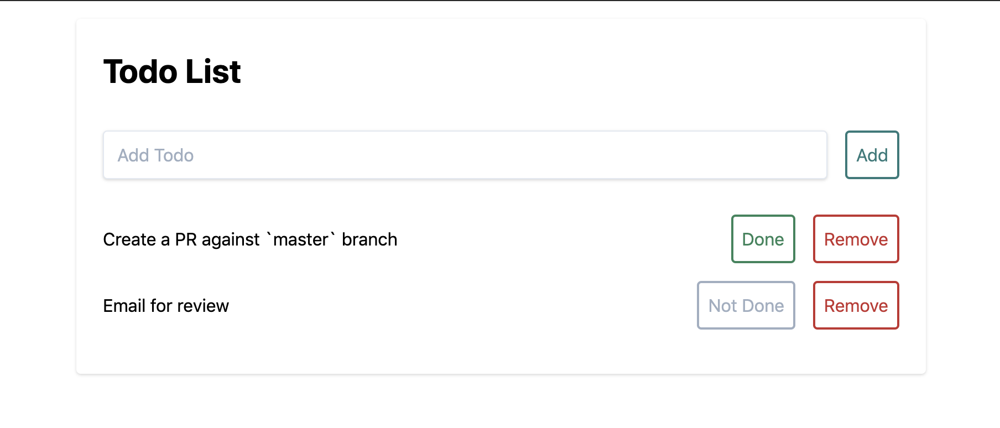

> This project was bootstrapped with [Create React App](https://github.com/facebook/create-react-app).

# Readme

To run this app, you should fork this repo to your Github profile and clone that repo down locally.

When you want to turn in your Challenge, create a PR with your cloned repo to the PMG repo. Please leave this on your repo for enough time for PMG developers to review.

Then run `npm install`

Then run `npm run start`

This does assume you have `npm` (Node Package Manager) [installed](https://www.npmjs.com/get-npm), as well as `git` [Git](https://git-scm.com/book/en/v2/Getting-Started-Installing-Git);

Once installed, start the code challenge in `Challenge.md`
